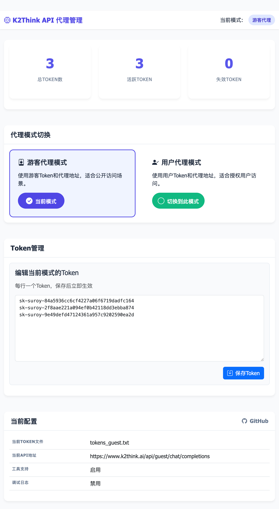

# K2Think API Proxy

基于 FastAPI 构建的 K2Think AI 模型代理服务，提供 OpenAI 兼容的 API 接口及简易管理页面。

## 功能特性

- 🧠 **MBZUAI K2-Think 模型**: 支持 MBZUAI 开发的 K2-Think 推理模型
- 🔄 **OpenAI 兼容**: 完全兼容 OpenAI API 格式，无缝对接现有应用
- ⚡ **流式响应**: 支持实时流式聊天响应，支持是否输出thinking
- 🛠️ **工具调用**: 支持 OpenAI Function Calling，可集成外部工具和API
- 📊 **文件上传**: 支持文件、图像上传
- 🔄 **Token轮询与负载均衡**: 支持多token轮流使用，自动故障转移
- 🛡️ **智能失效检测**: 自动标记失效token，三次失败后自动禁用
- 📈 **Token池管理**: 提供管理API查看状态、重置token等
- 🎛️ **端点代理切换**: 提供游客模式、用户模式，支持免配置使用
- ⌨️ **管理面板**: 提供基础的后台仪表盘，可以在线配置token
- 🚀 **高性能**: 异步处理架构，支持高并发请求
- 🐳 **容器化**: 支持 Docker 部署

## 快速开始

### 本地运行

1. **安装依赖**

```bash
pip install -r requirements.txt
```

2. **配置环境变量**

```bash
cp .env.example .env
# 编辑 .env 文件，配置你的API密钥和其他选项
```

3. **准备Token文件**

```bash
# 复制token示例文件并编辑
cp tokens.example.txt tokens.txt
# 编辑tokens.txt文件，添加你的实际K2Think tokens
```

4. **启动服务**

```bash
python k2think_proxy.py
```

服务将在 `http://localhost:8001` 启动。

5. **后台管理**

后台页面 `http://localhost:8081/admin`



### Docker 部署

#### 构建镜像部署

1. **构建镜像**

```bash
# 构建镜像 
docker build -t k2think-api .
```

2. **运行容器**

```bash
# 先创建 .env 文件和tokens.txt，然后编辑配置
cp .env.example.env
cp tokens.example.txt tokens.txt
# 编辑tokens.txt添加实际的token

# 运行容器
docker run -d \
  --name k2think-apis \
  -p 8001:8001 \
  -v $(pwd)/tokens.txt:/app/tokens.txt \
  -v $(pwd)/.env:/app/.env:ro \
  k2think-api
```

#### docker-compose部署

3. **或者直接使用 docker-compose**

```bash
# 先创建 .env 文件和tokens.txt
cp .env.example.env
touch tokens_guest.txt
cp tokens.example.txt tokens.txt
# 编辑 .env 文件配置API密钥等
# 编辑 tokens.txt 添加实际的K2Think tokens

# 启动服务
docker-compose up -d

# 检查服务状态
docker-compose logs -f k2think-api
```

注意: 【游客模式】无需配置 `tokens.txt`

## API 接口

### 聊天补全

**POST** `/v1/chat/completions`

```bash
curl -X POST http://localhost:8001/v1/chat/completions \
  -H "Content-Type: application/json" \
  -H "Authorization: Bearer sk-k2think" \
  -d '{
    "model": "MBZUAI-IFM/K2-Think",
    "messages": [
      {"role": "user", "content": "你擅长什么？"}
    ],
    "stream": false
  }'
```

### 模型列表

**GET** `/v1/models`

```bash
curl http://localhost:8001/v1/models \
  -H "Authorization: Bearer sk-k2think"
```

### Token管理接口

查看token池状态：

```bash
curl http://localhost:8001/admin/tokens/stats
```

重置指定token：

```bash
curl -X POST http://localhost:8001/admin/tokens/reset/0
```

重置所有token：

```bash
curl -X POST http://localhost:8001/admin/tokens/reset-all
```

重新加载token文件：

```bash
curl -X POST http://localhost:8001/admin/tokens/reload
```

## 环境变量配置

### 基础配置

| 变量名              | 默认值                                      | 说明                 |
| ------------------- | ------------------------------------------- | -------------------- |
| `VALID_API_KEY`   | 无默认值                                    | API 访问密钥（必需） |

### 服务器配置

| 变量名           | 默认值      | 说明                 |
| ---------------- | ----------- | -------------------- |
| `HOST`         | `0.0.0.0` | 服务监听地址         |
| `PORT`         | `8001`    | 服务端口             |
| `TOOL_SUPPORT` | `true`    | 是否启用工具调用功能 |

详细配置说明请参考 `.env.example` 文件。

## Python SDK 使用示例

```python
import openai

# 配置客户端
client = openai.OpenAI(
    base_url="http://localhost:8001/v1",
    api_key="sk-k2think"
)

# 发送聊天请求
response = client.chat.completions.create(
    model="MBZUAI-IFM/K2-Think",
    messages=[
        {"role": "user", "content": "解释一下量子计算的基本原理"}
    ],
    stream=False
)

print(response.choices[0].message.content)

# 流式聊天
stream = client.chat.completions.create(
    model="MBZUAI-IFM/K2-Think",
    messages=[
        {"role": "user", "content": "写一首关于人工智能的诗"}
    ],
    stream=True
)

for chunk in stream:
    if chunk.choices[0].delta.content is not None:
        print(chunk.choices[0].delta.content, end="")
```

## 模型特性

K2-Think 模型具有以下特点：

- **推理能力**: 模型会先进行思考过程，然后给出答案
- **响应格式**: 使用 `<think></think>` 和 `<answer></answer>` 标签结构化输出
- **多语言支持**: 支持中文、英文等多种语言
- **专业领域**: 在数学、科学、编程等领域表现优秀

## 故障排除

### 常见问题

1. **Token 相关问题**

   - **所有token失效**: 访问 `/admin/tokens/stats` 查看token状态，使用 `/admin/tokens/reset-all` 重置所有token
   - **添加新token**: 编辑 `tokens.txt` 文件添加新token，然后访问 `/admin/tokens/reload` 重新加载
   - **查看token状态**: 访问 `/health` 端点查看简要统计，或 `/admin/tokens/stats` 查看详细信息
2. **端口冲突**

   - 修改 `PORT` 环境变量
   - 或使用 Docker 端口映射

### 日志查看

```bash
# Docker 容器日志
docker logs k2think-api

# docker-compose日志
docker-compose logs -f k2think-api

# 本地运行日志
# 日志会直接输出到控制台
```

### Docker部署注意事项

1. **Token文件映射**

   - `tokens.txt` 通过volume映射到容器内，支持动态更新
2. **健康检查**

   - Docker容器包含健康检查机制
   - 可通过 `docker ps` 查看健康状态
3. **安全考虑**

   - 容器以非root用户运行
   - 敏感文件通过volume挂载而非打包到镜像中

## 工具调用功能

K2Think API 代理现在支持 OpenAI Function Calling 规范的工具调用功能。

### 功能特性

- ✅ 支持 OpenAI 标准的 `tools` 和 `tool_choice` 参数
- ✅ 自动工具提示注入和消息处理
- ✅ 流式和非流式响应中的工具调用检测
- ✅ 智能 JSON 解析和工具调用提取
- ✅ 支持多种工具调用格式（JSON 代码块、内联 JSON、自然语言）

### tool_choice 参数说明

- `"auto"`: 让模型自动决定是否使用工具（推荐）
- `"none"`: 禁用工具调用
- `"required"`: 强制模型使用工具
- `{"type": "function", "function": {"name": "tool_name"}}`: 强制使用特定工具

## 许可证

AGPL-3.0 License

## 贡献

> Thanks **[zhaoxiaozhao07](https://github.com/zhaoxiaozhao07/k2think2api)**, **[oDaiSuno](https://github.com/oDaiSuno/k2think2api)**

欢迎提交 Issue 和 Pull Request！
